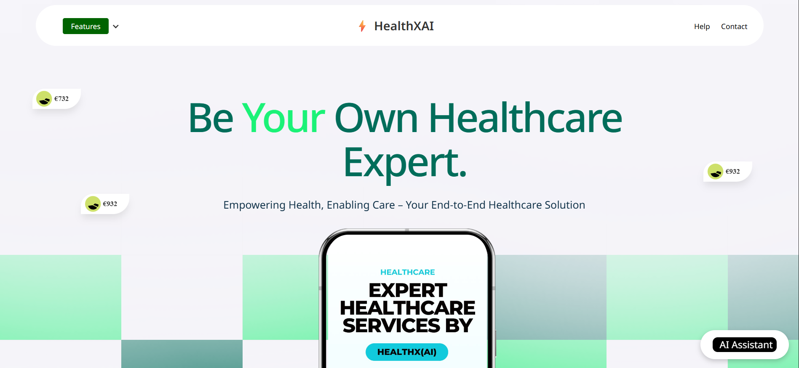
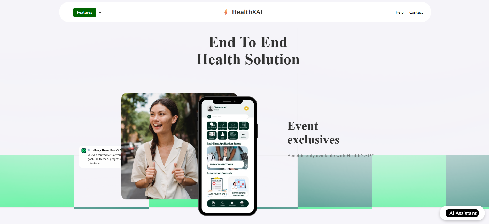
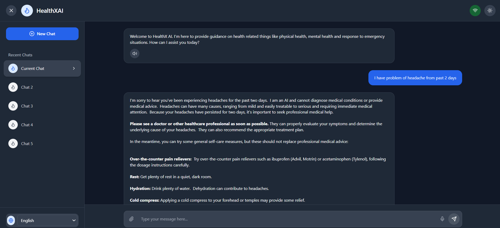
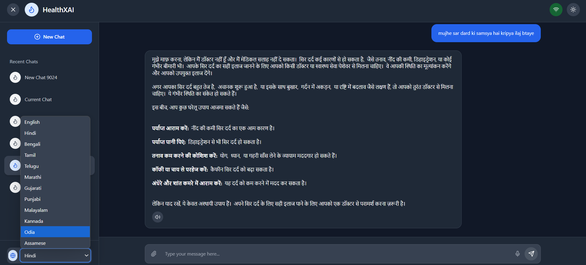
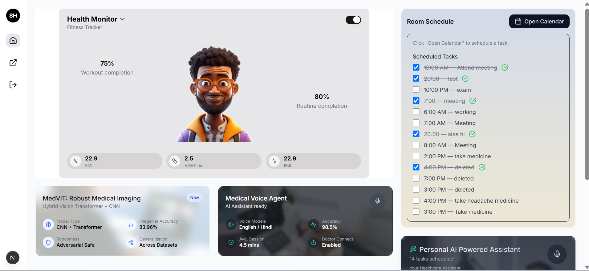
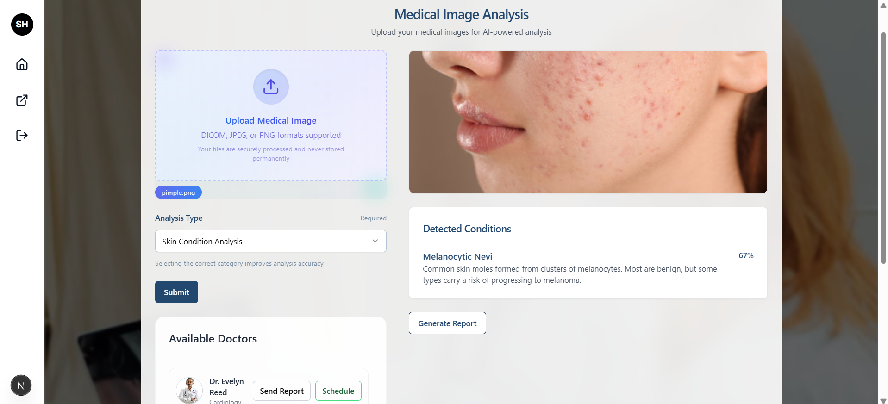
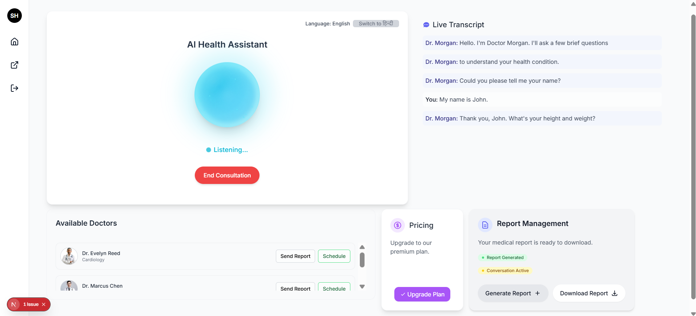
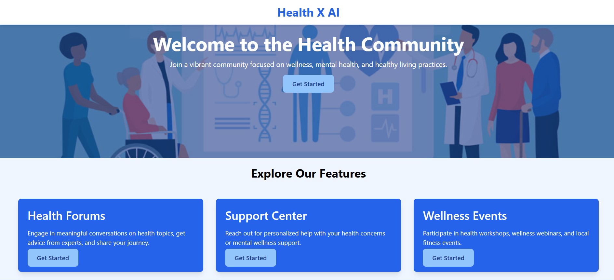
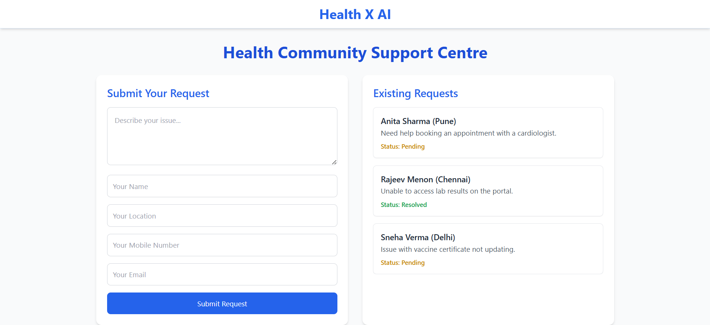

# 🧠 Health X AI

*Revolutionizing healthcare with the power of intelligent technology.*

---

Your Personal AI-Powered Health Companion  
A futuristic healthcare platform powered by voice, vision, and multi-agent AI systems to deliver end-to-end medical, fitness, and wellness solutions.

---

## 🌐 Key Features

- **Main UI (HomePage)**  
  Consists of brilliant UI and design, and is accompanied with a link to the AI Health Chatbot.

---

### 📸 Homepage Preview

  

---

- **Multilingual Chatbot**  
  An intelligent, user-friendly chatbot capable of interacting in multiple languages to assist users in managing their health and wellness needs.

---

### 🤖 Chatbot Preview

  

---

- **Personal Dashboard**  
  A brilliantly designed interface offering a personalized health experience. It includes an **Interactive 3D Lifestyle Avatar** — a virtual model that reflects your posture, health state, and activity in real time.

  **🧾 Description:** A visually rich dashboard integrating personal health stats with dynamic 3D visualization.  
  **⚙️ Built With:** WebGL, Three.js, Next JS, Tailwind CSS, and real-time data integration.  
  **🧩 Solves:** Lack of visual engagement and personalization in traditional health platforms.

---

### 🤖 Dashboard Preview

---

- **MedVit – Medical Image Analysis**  
  AI-powered tool to analyze medical scans like X-rays and MRIs to generate intelligent health reports.

  **🧾 Description:** AI-driven diagnosis assistant for medical imaging.  
  **⚙️ Built With:** Vision Transformers (MedVit), integrated with report sharing.  
  **🧩 Solves:** Manual diagnosis delays & errors.
  **Note:** Whe have provided the MedVIT Model specifications in the project folder as well.

---

### 🤖 MedVit Preview

---

- **Personalised Voice Agent (VAPI) & Routine Planner**  
  Conversational AI assistant that understands you and helps manage your health routines and daily habits.

  **🧾 Description:** Conversational AI assistant that understands you and plans your health routines.  
  **⚙️ Built With:** VAPI voice model, calendar & habit scheduling modules.  
  **🧩 Solves:** Poor lifestyle management & missed health routines.

---

### 🤖 Personalised Voice Agent (VAPI) Preview

---

- **Voice-Based Medical Suite (Symptom Consultation)**  
  A comprehensive voice-powered assistant that enables users to consult symptoms, book appointments, and receive preliminary health reports—all through natural conversation.  
  Users can verbally describe their health symptoms to the assistant, which intelligently interprets and analyzes the input to provide potential diagnoses, suggest care paths, or escalate to a medical professional. The suite also supports voice-activated appointment scheduling and automated report generation for symptom history and consultation summaries.

  **🧾 Description:** Voice assistant for symptom input, appointment booking, and report sharing.  
  **⚙️ Built With:** Vapi speech model, and smart calendar/email APIs.  
  **🧩 Solves:** Complicated bookings and lack of early diagnosis tools.

---

### 🤖 Voice Based Medical Suite Preview

---

- **Community (Health)**  
  A social and supportive space within the platform that enables users to connect, share, and grow together in their health journeys.

  **🧾 Description:** An interactive community hub that fosters collective well-being and knowledge-sharing. It includes:  
  - **Support Centre**: A Q&A-driven environment where users can seek help, post queries, and get peer or expert support.  
  - **Wellness Events**: Track and register for health webinars, fitness challenges, and live wellness events.  
  - **Health Forums**: Topic-based discussion boards for users to engage in thoughtful health discussions and share personal experiences.

  **⚙️ Built With:**  Tailwind CSS , community threads and moderation tools.  
  **🧩 Solves:** Isolation in digital health platforms and lack of peer/community-driven wellness support and its a brilliant supportive health community.

---

### 🤝 Community HomePage Preview

---

## 🛠 How to Run the Project

This guide helps you run all parts of HealthX-AI locally on your system.

---

### ⚙ Frontend Setup (React + Tailwind CSS)

bash
# Navigate to frontend folder
cd frontend

# Install dependencies
npm install

# Start the frontend app
npm run dev

# 🧠 MedVit – Medical Image Analysis

**MedVit** is an AI-powered tool that analyzes medical images such as X-rays and MRIs to generate intelligent health insights and diagnosis reports. It is a part of the **HealthX-AI ecosystem**, designed to reduce manual diagnostic errors and speed up the reporting process.

---

## ⚙ Tech Stack

- **Python**
- **Flask (API Server)**
- **Vision Transformers (ViT)**
- **Pre-trained Medical Models**
- **Pillow & OpenCV** (for image handling)
- **JSON-based API responses**

---

## 🚀 Features

- 🖼 Upload and analyze medical scans (X-rays, MRIs)
- 🧠 AI-based classification & prediction
- 📤 Shareable health reports
- ⚡ Fast, secure, and locally hosted API

---

## 🛠 How to Run MedVit Locally

Follow these steps to set up and run the MedVit backend server on your machine:

bash
# Step 1: Open terminal in the MedVit project directory

# Step 2: Create a virtual environment
python -m venv venv

# If above command gives error, install requirements first:
pip install -r requirements.txt

# Step 3: Activate the virtual environment

# On Windows:
venv\Scripts\activate

# On macOS/Linux:
source venv/bin/activate

# Step 4: Start the Flask API server
python api.py

## 🌟 Why Our Project Stands Out

HealthX-AI isn’t just a health tech project — it's a *complete, intelligent healthcare ecosystem* designed for *real-world impact*.

### 🚀 Key Highlights:

- 🔗 *Unified Platform:* Integrates diagnostics, chatbot, voice assistant, 3D dashboard, and community into one seamless system.
- 🤖 *AI-Powered Intelligence:* Uses *Vision Transformers (MedVit)* for medical image analysis and *VAPI* for real-time voice-based interaction.
- 🧬 *Hyper-Personalized:* Every user has a 3D lifestyle avatar, personalized health stats, and multilingual assistance.
- 🎤 *Voice-Centric Care:* From symptom input to report generation and appointment booking — everything is voice-enabled.
- 👥 *Community Wellness:* Support centers, live events, and health forums to connect users with each other and professionals.
- 🖼 *Interactive Visuals:* Engaging UI using WebGL and Three.js to bring health data to life.
- 🧩 *Real Problem-Solving:* Addresses delayed diagnosis, fragmented platforms, and low user motivation with end-to-end digital health support.
- ⚙ *Modern & Scalable Stack:* Built using React, Tailwind CSS, Flask, Python, WebGL — ready for expansion.

> HealthX-AI doesn’t just look good — it *works smart*, feels human, and scales easily.

---

## 🔚 Final Thoughts

*HealthX-AI is not just a health app — it's your intelligent wellness companion.*  
By fusing modern AI with a human-centered interface, HealthX-AI empowers users to take control of their physical, emotional, and social well-being.

It’s built for everyone — from tech-savvy patients to busy caregivers — and aims to create a *connected, compassionate, and AI-powered future of healthcare*.

> 💡 Built with care.  
> 🤖 Powered by intelligence.  
> 🌍 Designed to make a difference.

---