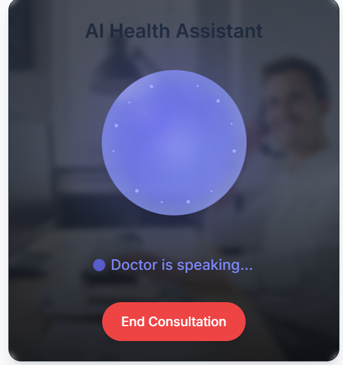

# 🧠 Health X AI

*Revolutionizing healthcare with the power of intelligent technology.*

---

Your Personal AI-Powered Health Companion  
A futuristic healthcare platform powered by voice, vision, and multi-agent AI systems to deliver end-to-end medical, fitness, and wellness solutions.

---

## 🌐 Key Features

- **Main UI (HomePage)**  
  Consists of brilliant UI and design, and is accompanied with a link to the AI Health Chatbot.

---

### 📸 Homepage Preview

  

---

- **Multilingual Chatbot**  
  An intelligent, user-friendly chatbot capable of interacting in multiple languages to assist users in managing their health and wellness needs.

---

### 🤖 Chatbot Preview

  

---

- **Personal Dashboard**  
  A brilliantly designed interface offering a personalized health experience. It includes an **Interactive 3D Lifestyle Avatar** — a virtual model that reflects your posture, health state, and activity in real time.

  **🧾 Description:** A visually rich dashboard integrating personal health stats with dynamic 3D visualization.  
  **⚙️ Built With:** WebGL, Three.js, Next JS, Tailwind CSS, and real-time data integration.  
  **🧩 Solves:** Lack of visual engagement and personalization in traditional health platforms.

---

### 🤖 Dashboard Preview

---

- **MedVit – Medical Image Analysis**  
  AI-powered tool to analyze medical scans like X-rays and MRIs to generate intelligent health reports.

  **🧾 Description:** AI-driven diagnosis assistant for medical imaging.  
  **⚙️ Built With:** Vision Transformers (MedVit), integrated with report sharing.  
  **🧩 Solves:** Manual diagnosis delays & errors.
  **Note:** Whe have provided the MedVIT Model specifications in the project folder as well.

---

### 🤖 MedVit Preview

---

- **Personalised Voice Agent (VAPI) & Routine Planner**  
  Conversational AI assistant that understands you and helps manage your health routines and daily habits.

  **🧾 Description:** Conversational AI assistant that understands you and plans your health routines.  
  **⚙️ Built With:** VAPI voice model, calendar & habit scheduling modules.  
  **🧩 Solves:** Poor lifestyle management & missed health routines.

---

### 🤖 Personalised Voice Agent (VAPI) Preview

---

- **Voice-Based Medical Suite (Symptom Consultation)**  
  A comprehensive voice-powered assistant that enables users to consult symptoms, book appointments, and receive preliminary health reports—all through natural conversation.  
  Users can verbally describe their health symptoms to the assistant, which intelligently interprets and analyzes the input to provide potential diagnoses, suggest care paths, or escalate to a medical professional. The suite also supports voice-activated appointment scheduling and automated report generation for symptom history and consultation summaries.

  **🧾 Description:** Voice assistant for symptom input, appointment booking, and report sharing.  
  **⚙️ Built With:** Vapi speech model, and smart calendar/email APIs.  
  **🧩 Solves:** Complicated bookings and lack of early diagnosis tools.

---

### 🤖 Voice Based Medical Suite Preview

---

- **Community (Health)**  
  A social and supportive space within the platform that enables users to connect, share, and grow together in their health journeys.

  **🧾 Description:** An interactive community hub that fosters collective well-being and knowledge-sharing. It includes:  
  - **Support Centre**: A Q&A-driven environment where users can seek help, post queries, and get peer or expert support.  
  - **Wellness Events**: Track and register for health webinars, fitness challenges, and live wellness events.  
  - **Health Forums**: Topic-based discussion boards for users to engage in thoughtful health discussions and share personal experiences.

  **⚙️ Built With:**  Tailwind CSS , community threads and moderation tools.  
  **🧩 Solves:** Isolation in digital health platforms and lack of peer/community-driven wellness support and its a brilliant supportive health community.

---

### 🤝 Community HomePage Preview

---
